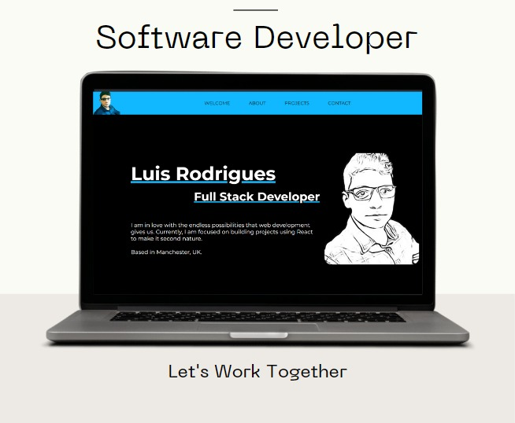

<h1 align='center'>
Luis Rodrigues -- Portfolio V2
</h1>

 

Built with ReactJS v18.0 and deployed using Netlify.

### Live
[withluis.com](https://withluis.com/)
 

### Run locally
- npm i
- update .env
- npm start

### Dependencies
- react-icons 
- react-modal
- emailjs-com
- sweetalert2

### Folder Structure
- public
    - images (project Images)
- src
    - components (Navbar, Project, DisplayModal, SocialMediaShare )
    - sections (Home, About, Projects, Contact, Footer)
    - libs (projects data)

